# flutter_neumorphic

[]()

[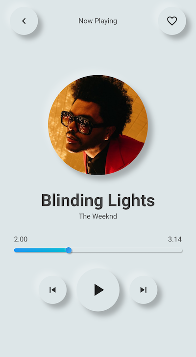]()
[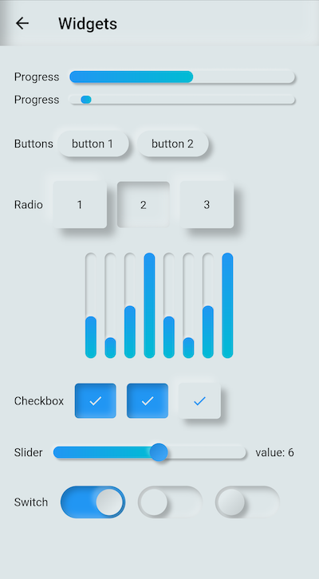]()

A complete, ready to use, Neumorphic ui kit for Flutter

# ⚙️ Installation

https://pub.dev/packages/flutter_neumorphic

[](
https://pub.dartlang.org/packages/flutter_neumorphic)

```dart
dependencies:
  flutter_neumorphic: ^1.0.0
```

The in your .dart files 
```dart
import 'package:flutter_neumorphic/flutter_neumorphic.dart';
```

# What's neumorphic

[]()

## Material Cards

A Modern / Material (upgraded) card usually is a surface floating on top of our perceived background and casting a shadow onto it. The shadow both gives it depth and also in many cases defines the shape itself — as it’s quite often borderless.

## Neumorphic cards

Neumorphic card however pretends to extrude from the background. It’s a raised shape made from the exact same material as the background. When we look at it from the side we see that it doesn’t “float”.

# 🗂 Widgets

| Preview | Widget | Description | 
|-|-|-|
| [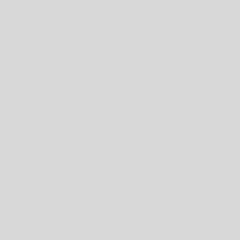]()  | [Neumorphic]() | The main Neumorphic Widget, a container which adds white/dark gradient depending on a lightsource and a depth |
| [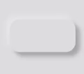]() | [NeumorphicButton]() | A neumorphic button that plays with the depth to respond to user interraction |
| [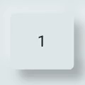]() | [NeumorphicRadio]() | A set of neumorphic button whith only one selected at time, depending on a value & groupValue | 
| []() | [NeumorphicCheckbox]() | A button associated with a value, can be checked/unckecked, if checked, takes the accent color |
| [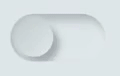]() | [NeumorphicSwitch]() | An On/Off toggle, associated with a value, if toggled, takes the accent color | 
| [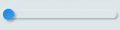]() | [NeumorphicSlider]() | A Neumorphic seekbar (range slider), the user can select a value in a range | 
| [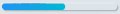]()  | [NeumorphicProgress]() | A determinate progress, takes the displayed percentage | 
| [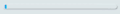]()  | [NeumorphicIndeterminateProgress]() | An inderminate progress-bar | 
| [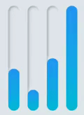]() | [NeumorphicIndicator]() | A vertical / horizontal indicator bar, takes a percentage | 
| [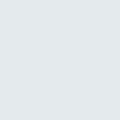]() | [NeumorphicBackground]() | Take the background color of the theme, can clip the screen with a borderRadius | 

## 📦 Neumorphic

```dart

Neumorphic(
  boxShape: NeumorphicBoxShape.roundRect(borderRadius: BorderRadius.circular(12)), 
  style: NeumorphicStyle(
    shape: NeumorphicShape.concave,
    depth: 8,
    lightSource: LightSource.topLeft,
    color: Colors.grey
  ),
  child: ...
)
```

[]()
[]()

☝️ Playing with LightSource & Depth

### 🛠️ Attributes

| Attributes | Values | Description |
|-----------------------|---|---|
| LightSource | TopLeft, BottomRight, etc. / (dx, dy) | The source of light specifit to the theme or the widget, used to project white/dark shadows on neumorphic elements |
| [Shape](#-shapes) | Concave / Convex / Flat | The shape of the curve used in the neumorphic container |
| Depth | -20 <= double <= 20 | The distance of the widget to his parent. Can be negative => emboss. It influences on the shadow's color and its size/blur |
| Intensity | 0 <= double <= 1 | The intensity of the Light, it influences on the shadow's color |
| Color | any Color | The default color of  Neumorphic elements | 
| Accent | any Color | The default accent color of the Neumorphic element when activated (eg: checkbox) | 
| Variant | any Color | The default secondary color of the Neumorphic element (eg: used as second color on the progress gradient) | 
| BoxShape | Circle, RoundRect(radius), Stadium | The box shape of a Neumorphic element. Stadium : roundrect with cirlces on each side | 

### 🔧 Shapes

| Shape | WIDGET | IMAGE | CONDITION | 
|-------|---|-------|---|
| Flat | [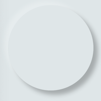]()  | []() | depth >= 0 && shape == Flat |
| Convex | [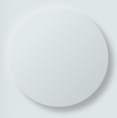]()  | [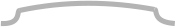]() | depth >= 0 && shape == Convex |
| Concave | [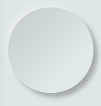]() | [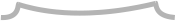]() | depth >= 0 && shape == Concave |
| Emboss | [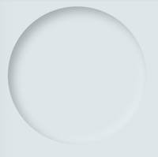]()  | [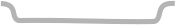]() | depth < 0 |

## 🎨 Neumorphic Theme


[]()
[]()

```dart
NeumorphicTheme(
    currentTheme: CurrentTheme.LIGHT, //or DARK / SYSTEM
    darkTheme: NeumorphicThemeData(
        baseColor: Color(0xff333333),
        accentColor: Colors.green,
        lightSource: LightSource.topLeft,
        depth: 4,
        intensity: 0.3,
    ),
    theme: NeumorphicThemeData(
        baseColor: Color(0xffDDDDDD),
        accentColor: Colors.cyan,
        lightSource: LightSource.topLeft,
        depth: 6,
        intensity: 0.5,
    ),
    child: ...
)
```

To retrieve the current used theme :

```dart
final theme = NeumorphicTheme.getCurrentTheme(context);
final baseColor = theme.baseColor;
final accentColor = theme.accentColor;
...
```

Toggle from light to dark
```dart
NeumorphicTheme.of(context).currentTheme = CurrentTheme.DARK;
```

Know if using dark
```dart
if(NeumorphicTheme.of(context).isUsingDarkMode){
  
}
```

# 👥 Contributors

| | Contributors |
|:-:|--------------|
| [](https://github.com/florent37) | [Florent Champigny](https://github.com/florent37) |
| [](https://github.com/Debilobob) | [Olivier Bonvila](https://github.com/Debilobob)  |
| [](https://github.com/almighty972) | [Gyl Jean Lambert](https://github.com/almighty972)  |

## 📄 License

Flutter-Neumorphic is released under the Apache2 license.
See [LICENSE](./LICENSE) for details.

If you use the open-source library in your project, please make sure to credit and backlink to www.idean.com

[](https://www.idean.com)
